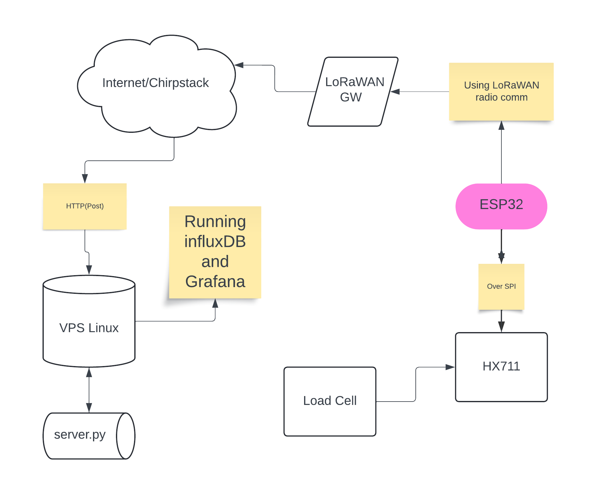

# Building a Smart Lashing Detection System

**Name:** Andreas Nilsson  
**Student Credentials:** an224qi
**Time to setup:** ~1 hour

# Table of Contents

1. [Short Project Overview](#short-project-overview)
2. [Objective](#objective)
3. [Material](#material)
   - [List of Material](#list-of-material)
   - [What the Different Components Do](#what-the-different-components-do)
4. [Requirements](#requirements)
5. [Putting Everything Together](#putting-everything-together)
6. [Steps to Configure HX711 and LoRaWAN](#steps-to-configure-hx711-and-lorawan)
7. [Chosen IDE and Steps](#chosen-ide-and-steps)
8. [Platform Setup](#platform-setup)
9. [The Code (main.c)](#the-code-mainc)
   - [Codebase](#codebase)
   - [Setup and Helium.](#setup-and-helium)
   - [Data Shifting Function Selection](#data-shifting-function-selection)
   - [GPIO Configuration](#gpio-configuration)
   - [TTN/Helium Initialization](#ttnhelium-initialization)
   - [HX711 Initialization](#hx711-initialization)
   - [Deep Sleep Resume Check](#deep-sleep-resume-check)
   - [TTN Joining](#ttn-joining)
   - [Starting HX711 Read](#starting-hx711-read)
   - [Sending Messages](#sending-messages)
   - [Preparing for Deep Sleep](#preparing-for-deep-sleep)
   - [Powering Down HX711](#powering-down-hx711)
   - [Delay and Enter Deep Sleep](#delay-and-enter-deep-sleep)
   - [Transmitting the Data / Connectivity](#transmitting-the-data--connectivity)
   - [Data Transmission](#data-transmission)
10. [Catching data with simple-post-server](#catching-data-with-simple-post-server)
    - [Simple Socket with HTTP](#simple-socket-with-http)
    - [Venv](#venv)
    - [Influx settings](#influx-settings)
    - [Running](#running)
    - [Testing it out](#testing-it-out)
    - [Battery Life and Range](#battery-life-and-range)
11. [Design Choices](#design-choices)
12. [Presenting the Data](#presenting-the-data)
    - [Dashboard](#dashboard)
    - [Data Retention](#data-retention)

## Short Project Overview
This project written in ESP-IDF involves assembling and configuring a system that uses load cells to detect whether lashing is executed correctly and remains secure throughout a shipping journey.

## Objective
* Ensuring the proper lashing of containers onboard ships is crucial for safety and preventing cargo damage.
* This project aims to alert the crew if the lashing slackens or fails, ensuring timely corrective measures.
* By monitoring the tension on container lashings continuously, we can reduce the risk of accidents and improve shipping safety protocols.

## Map


## Material

### List of Material
Here are the key components required to build this device:

1. **RS PRO Load Cell, 300kg Range, Compression, Tension Measure**
    - Quantity: 1
    - Price: ~€160
    - Shop: [RS-Online](https://se.rs-online.com/web/p/strain-gauges/2042768)
    - [Datasheet](https://docs.rs-online.com/b2dd/A700000007176393.pdf)

2. **Load Cell 300 kg for Tension and Compression, IP68, Stainless**
    - Quantity: 1
    - Price: ~€298
    - Shop: [Vetek](https://www.vetek.com/en/article/load-cell-300-kg-for-tension-and-compression-ip68-stainless)
    - [Datasheet](https://www.vetek.com/en/dynamics/WebFiles/document/71853b56-87c4-411f-a51d-bdafb98a6e72/Datasheet_101BS_V2.pdf)

3. **Articulated Rod-End Ball Joint for S-Load Cell M12x1.75**
    - Quantity: 2
    - Price: ~€28
    - Shop: [Vetek](https://www.vetek.com/en/article/articulated-rod-end-ball-joint-for-s-load-cell-m12x1-75)
    - [Datasheet](https://www.vetek.com/en/dynamics/WebFiles/document/27fe49d1-d544-4471-baf0-c7c44f18191e/Datasheet_RBJ_V1.pdf)

4. **HX711 Load Cell Amplifier**
    - Quantity: 1
    - Price: ~€12
    - Shop: [Electrokit](https://www.electrokit.com/forstarkare-for-lastceller-hx711)
    - [Datasheet](https://www.electrokit.com/upload/product/41016/41016232/hx711_english.pdf)
5. **Heltec V2 LoRa**
   - Quantity: 1
   - Price: ~€30
     

**Total Cost:** ~€556

### What the Different Components Do
- **Load Cell:** Measures tension or compression force.
- **HX711 Load Cell Amplifier:** Amplifies the small analog signal from the load cell and converts it to a digital signal.
- **Articulated Rod-End Ball Joint:** Provides flexible connection points for the load cell to the lashing system.
- **Heltec V2 LoRa:** The MCU featuring a ESP32 with an onboard SX1262 chip(The LoRa module). Responsible for executing the code and talk to the HX711 and SX1262 

## Requirements
- A computer running macos, linux och windows. Host influxdb either locally or on a VPS(Virtual private server)
- Materials above
- Breadboard
- Connection wire
- USB -> micro-usb cable

### Putting Everything Together

### Circuit Diagram and Wiring


Connect everything on a breadboard.

1. **Connect the Load Cell to the HX711 Amplifier**:
    - Red (E+): Connect to E+ on HX711.
    - Black (E-): Connect to E- on HX711.
    - White (A-): Connect to A- on HX711.
    - Green (A+): Connect to A+ on HX711.

2. **Connect the HX711 to the Heltec ESP32 V2**:
    - VCC: Connect to the 3.3V pin on the ESP32.
    - GND: Connect to a GND pin on the ESP32.
    - DT (Data): Connect to GPIO 12 on the ESP32.
    - SCK (Clock): Connect to GPIO 13 on the ESP32.


### HX711


### When completed


---
## Steps to Configure HX711 and LoRaWAN

**First choose correct pins for SPI, byteorder and TX interval(in seconds):**
```c
#define TTN_PIN_SPI_SCLK 5
#define TTN_PIN_SPI_MOSI 27
#define TTN_PIN_SPI_MISO 19
#define TTN_PIN_NSS 18
#define TTN_PIN_RXTX TTN_NOT_CONNECTED
#define TTN_PIN_RST 14
#define TTN_PIN_DIO0 26
#define TTN_PIN_DIO1 35

#define TX_INTERVAL 30

#define DOUT_PIN 12
#define PD_SCK_PIN 13
#define LED_PIN 25
#define BYTE_ORDER LITTLE_ENDIAN

```
---

### Chosen IDE and Steps
**IDE Used:** Free of choice, I used Vim  
**Code Uploading:** Using `idf.py`  

**Steps:**

1. Clone the ESP-IDF repository:
    ```bash
    git clone --recursive https://github.com/espressif/esp-idf.git
    cd esp-idf
    ```

2. Install the ESP-IDF tools:
    ```bash
    ./install.sh
    ```

3. Set up the environment variables:
    ```bash
    . ./export.sh
    ```

4. Connect the Heltec ESP32 to your computer via USB

5. Change directory to your project's root folder

6. Set the target to ESP32 (if not already set):
    ```bash
    idf.py set-target esp32
    ```

7. Compile the code:
    ```bash
    idf.py build
    ```

8. Upload the code to the ESP32:
    ```bash
    idf.py flash
    ```

9. View the output from the ESP32 serial monitor:
    ```bash
    idf.py monitor
    ```

---
### Platform Setup
I am using Chirpstack and a VPS hosted on Linode running Ubuntu.

- [Chirpstack](https://console.helium-iot.xyz/)
- [Linode](https://cloud.linode.com/)

I chose these platforms because I already had them, and they could be scaled significantly.

---

## The Code ([main.c](./main/main.c))
### Codebase
The code is written in C using ESP-IDF so its portable to basically any device of your choice. Easiest would be to use a Heltec with a LoRa onboard chip(SX126x / 127x). 
Ofcourse it will run directly on any ESP32 and by using a LoRa breakout board you can connect and configure it by SPI.

### Setup and Helium. 
In the app_main function, we first call the setup function to initialize various components such as GPIO pins, SPI bus, TTN/Helium settings, and the HX711 device. This initialization process sets up the necessary configurations and prepares the device for operation. 

#### Data Shifting Function Selection

The setup function begins by selecting the appropriate shift_data function based on the system's byte order (endian format). This is done using BYTE_ORDER, which checks if the system is Big Endian or Little Endian and sets shift_data_func.

#### GPIO Configuration

The function configures the LED_PIN and another pin (26) as outputs. These pins are then set to a low level (turned off if active low).

#### TTN/Helium Initialization

- The GPIO ISR handler service is initialized, which provides routines to manage GPIO interrupt service routines.
- The NVS (Non-Volatile Storage) flash is initialized. This allows for saving and restoring keys.
- The SPI bus is initialized with the given pin configuration for MISO, MOSI, and SCLK.
- TTN (Using Helium, but lib is called TTN) is initialized and configured with the necessary pins for the SX127x LoRa module.
- The device is provisioned with the DevEUI, AppEUI, and AppKey. The line that provisions the device can be commented out after the first successful run because the data is saved in NVS.
- The function enables Adaptive Data Rate (ADR), sets the data rate, and sets the maximum transmit power.

#### HX711 Initialization
The HX711 load cell amplifier is initialized for reading data from the load cell.

#### Deep Sleep Resume Check
The code checks if the device has resumed from deep sleep using ttn_resume_after_deep_sleep(). If true, it logs that resumption has occurred.

#### TTN Joining
If the device has not resumed from deep sleep, it attempts to join the TTN network. If the join is successful, it logs this; otherwise, it logs an error and exits the function.

#### Starting HX711 Read
It logs that reading from the HX711 sensor is starting. The read_from_hx711 function is called with the appropriate data shifting function. This reads the data from the HX711 sensor and applies the endian-specific byte shifting.

#### Sending Messages
The sendMessages function is called to send the read data over the network.

#### Preparing for Deep Sleep
The function logs that the device is preparing for deep sleep.
It waits for TTN communication to become idle and prepares the TTN component for deep sleep.
The timer wake-up interval is set to TX_INTERVAL seconds.

#### Powering Down HX711
The HX711 is powered down, and the function logs whether the operation was successful or not.

#### Delay and Enter Deep Sleep
The code delays for one second before logging that it is entering deep sleep for the specified interval.
The device then enters deep sleep mode using esp_deep_sleep_start(), conserving power until the next scheduled wake-up.

### Transmitting the Data / Connectivity
### Data Transmission
The data is sent every 15 minutes (can be changed in code, `TX_INTERVAL`) over LoRaWAN using the Helium network and Chirpstack. LoRaWAN is best suited here because of the low amount of data being sent and the improved battery life due to not using Wi-Fi. The data is transmitted over LoRaWAN (routed in the Helium network) to Chirpstack.
```c
/** 
 * This function shifts the bits of a 32-bit signed integer and stores each byte into an array,
 * prepping it for being sent over LoRaWAN, depending on your choice of the BYTE_ORDER macro.
 *
 *      - During each iteration:
 *          - The dereferenced value of `data` is bitwise right-shifted by `(i * 8)` bits. 
 *            This operation effectively moves the byte for the current loop iteration to the rightmost position.
 *
 *          - The result is then bitwise ANDed with `0xFF` to isolate the least significant byte.
 *
 *          - The isolated byte is then stored in the `msgData` array at index `i`.
 *          This results in filling the `msgData` array with individual bytes from the input integer.
 */
static void shift_data_le(const int32_t *data) {
  for (int i = 0; i < sizeof(msgData); ++i) {
    msgData[i] = ((int32_t)*data >> (i * 8)) & 0xFF;
  }
}

static void shift_data_be(const int32_t *data) {
  for (int i = 0; i < sizeof(msgData); ++i) {
    msgData[sizeof(msgData) - 1 - i] = ((int32_t)*data >> (i * 8)) & 0xFF;
}

/**
* The function pointer points to either of the functions depending on chosen byte order.
*/
typedef void (*shift_data_func_t)(const int32_t *);
...

shift_data_func_t shift_data_func;

switch (BYTE_ORDER) {
case BIG_ENDIAN:
  shift_data_func = shift_data_be;
  break;
case LITTLE_ENDIAN:
  shift_data_func = shift_data_le;
}
...
read_from_hx711(shift_data_func);
...
sendMessages();
```

---

## Catching data with simple-post-server
### Simple Socket with HTTP
Using a simple Python script that listens for data sent from Chirpstack (via HTTP) by posting to the socket on my VPS. The server then uses a library called InfluxDBClient to insert a Point object in the Influx database.

### Venv
Open a new terminal, cd to this repo root directory and enter 
1. `python -m venv simple-post-server`
2. `cd simple-post-server`
3. `source bin/activate`
4. `pip install -r requirements.txt`

### Influx settings
In [server.py](./simple-post-server/server.py) insert your token, org, url and bucket obtained from your influxdb instance
```python
        token = ""
        org = ""
        url = ""
        bucket = ""
```

### Running
First you might want to check if its working, so run the python script normally.
`python server.py`

When its working enter this so it will run in the background.
`nohup python3 server.py > /dev/null 2>&1 &`

To kill the process you could do:
`ps aux | grep server.py`

Grab the pid and run:
`kill -9 <pid>`

(Replace `python` with your python binary on your system.)

### Testing it out
#### Using CURL
- Do a post-request to validate that you are getting data. Either using a `curl -X POST -d "{}" -h http://<your-ip-to-server-running-simplepostserver>`

#### Using Chirpstack 
- Simply watch the video and enter the details for HTTP integration in Chirpstack.


#### Battery Life and Range
The battery life is significantly better with LoRaWAN than traditional Wi-Fi. The range is also better considering that it might be installed on a boat/ship which could be very long, and the signal is being transmitted through thick walls. Wi-Fi might end up short here; a simple Dragino or RAK gateway installed on the boat/ship would do the job. LoRaWAN radio signals also utilize sub-GHz bandwidth, allowing better penetration through different materials.

---

## Design Choices
**LoRaWAN:** Chosen for its long range and low power consumption, suitable for maritime environments.
**MQTT:** Efficient for low-bandwidth communications.

---

## Presenting the Data
### Dashboard
#### Dashboard built using Grafana
- Here we can see a three day journey with Calmare nyckel. The tension in the diagram isn't actually tension drop, its the load cell that is temperature sensitive.


### Data Retention
The data is put into buckets with a retention period of 30 days.
I chose InfluxDB because it's a time-series database. I could have chosen MongoDB or other time-series databases, but I find InfluxDB the easiest to work with.

With this guide, you should be able to build and monitor a smart lashing system for onboard ship containers, ensuring cargo safety during transit.
```
